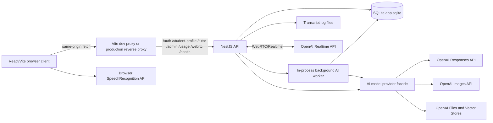

# EGMathTeacher Architecture

This file records the current repository architecture from source evidence.

## System Shape

EGMathTeacher is a browser-based POC with:

- React/Vite web client in `apps/web`
- NestJS API in `apps/api`
- SQLite local persistence through `node:sqlite`
- POC SQLite schema migration ledger in `schema_migrations`
- OpenAI-first model provider facade for tutor answers, specialist profile
  generation, delayed background assistant work, RAG files/vector stores, and
  image generation
- Local knowledge-pack ingestion and RAG sync tooling that imports structured
  JSON/JSONL into SQLite and optionally syncs selected Markdown files to
  OpenAI vector stores by content hash. Active imported curriculum/task-bank
  rows are used by the lesson runtime for curriculum resolution and supported
  task selection.
- Role/operation model policy inside the model facade so tutor, onboarding,
  lesson-decision, background, quality-review, and image assistant roles can
  use different models and service-tier settings
- SQLite-backed background AI worker for optional grouped learning observation
  windows, learning signals, session summaries, skill progress/regression,
  profile/strategy refreshes, and rare quality reviews
- SQLite-backed lesson lifecycle, Lesson Decision Agent observability,
  DB-backed curriculum/task-bank runtime lookups, deterministic verifier V1,
  imported mastery-criteria policy, and usage ledger for lesson goals,
  time-limit heuristics, backend policy decisions, effectiveness signals,
  verified learning outcomes, and user-visible cost estimates
- OpenAI Realtime for inherited realtime voice
- optional production reverse proxy references under `deploy/`

No packaged desktop runtime was found.

## Source Architecture Diagrams

Editable Mermaid source diagrams live under `.ai/project/diagrams`. Rendered
SVG artifacts live under `.ai/project/diagrams/rendered` and are generated by
`npm run diagrams:render`.

Primary diagram sources:

- `.ai/project/diagrams/system-context.mmd`
- `.ai/project/diagrams/api-modules.mmd`
- `.ai/project/diagrams/onboarding-profile-sequence.mmd`
- `.ai/project/diagrams/tutor-rag-sequence.mmd`
- `.ai/project/diagrams/knowledge-upload-sequence.mmd`
- `.ai/project/diagrams/knowledge-pack-runtime-repair.mmd`
- `.ai/project/diagrams/webrtc-realtime-sequence.mmd`
- `.ai/project/diagrams/data-model.mmd`
- `.ai/project/diagrams/assistant-governance.mmd`
- `.ai/project/diagrams/ui-tree.mmd`

The overview below mirrors `system-context.mmd` for quick reading.

## API Modules

| Module | Source | Responsibility |
| --- | --- | --- |
| `AppModule` | `apps/api/src/app.module.ts` | Loads global config and imports project modules. |
| `AuthModule` | `apps/api/src/auth` | Local registration, login, signed cookie sessions, admin/student roles. |
| `DatabaseModule` | `apps/api/src/database` | SQLite database initialization and query helpers. |
| `OpenAiClientModule` | `apps/api/src/openai` | REST client for OpenAI Responses, images, files, and vector stores. |
| `AiModelModule` | `apps/api/src/ai-model` | Model-provider facade and role/operation policy for profile, lesson-decision, tutor, background, image, file, and vector-store operations; OpenAI implemented, other providers stubbed. |
| `BackgroundAiModule` | `apps/api/src/background-ai` | SQLite-backed background AI queue for stored tutor observations, grouped learning-window analysis, session summaries, skill progress/regression rows, profile/strategy refreshes, legacy per-turn background jobs, and authenticated recovery of safe failed jobs. |
| `LessonModule` | `apps/api/src/lesson` | Lesson session lifecycle, Lesson Decision Agent orchestration, backend action policy, stricter DB-backed curriculum resolution, task-bank-backed supported task selection, deterministic verifier V1, source-task-deduplicated mastery policy, misconception-aware hint routing, goal status, configurable learning-time heuristics, decision observability, verified mastery evidence, and effectiveness-signal storage. |
| `UsageModule` | `apps/api/src/usage` | Authenticated user usage summaries backed by the local AI usage ledger, decision observability, verified outcome counts, and safe background job status/result/error projections. |
| `AiProviderModule` | `apps/api/src/providers` | Runtime voice provider abstraction; OpenAI Realtime implemented, other providers stubbed. |
| `StudentProfileModule` | `apps/api/src/student-profile` | First-login meeting profile generation, stored student memory, and explanation strategy retrieval. |
| `TutorModule` | `apps/api/src/tutor` | RAG tutor message handling, saved lesson history, and image generation. |
| `KnowledgeModule` | `apps/api/src/knowledge` | Admin knowledge upload, knowledge-pack structured import, strict/partial pack validation, content-hash Markdown RAG sync, strict authoritative deleted-path reconciliation, sync-job recovery for failed and attached timeout jobs, optional vector-store wait-ready with pending-index state, archive guardrails, vector store status, and local project vector-store id persistence. |
| `WebRtcModule` | `apps/api/src/webrtc` | Session bootstrap, signaling, media bridge, provider events. |
| `ConversationModule` | `apps/api/src/conversation` | In-memory conversation turns and transcript file persistence. |
| `HealthModule` | `apps/api/src/health` | Health response and WebRTC audio support status. |

## Web Client

The web client:

- uses React and Vite
- uses Mantine UI components
- uses lucide icons
- uses `apps/web/src/i18n.ts` for Russian and English static UI copy
- calls the API through `apps/web/src/api.ts`
- defaults API base to `window.location.origin`
- proxies API paths in Vite dev server to `http://127.0.0.1:3000`
- enables local HTTPS on port `5137` when `.cert/localhost-key.pem` and
  `.cert/localhost-cert.pem` exist

Main UI areas in `apps/web/src/App.tsx`:

- auth screen with login/register mode
- first-login student meeting for profile creation
- tutor workspace with lesson launcher, lesson mode selector, text input,
  saved lesson continuity panel, speech recognition input, and browser
  speech-synthesis output for visible tutor answers with automatic mic
  restart plus visible recognition stop reasons in voice-dialog mode
- user-visible lesson usage/debug bar with today's estimate, current lesson
  estimate, evidence level, verified outcome count, cost per verified outcome,
  expanded operation/model/token/image/decision details, background job status,
  and retry-one recovery for visible failed background jobs
- tutor turn cards for ordered text, task, example, and image response blocks,
  lesson-type badge, citations, optional image generation, and automatic
  generation for fresh required image blocks after the text answer is visible
- admin knowledge screen for file upload and status table
- settings screen for language, voice input language, account info, read-only
  student profile memory, recent session summaries, and skill
  progress/regression
- language switch shared by auth, first meeting, and authenticated app shell

## AI Model Provider Boundary

`apps/api/src/ai-model` owns the model-provider facade for profile generation,
lesson decisions, tutor responses, background assistant jobs, explanatory
images, file upload, and vector-store operations.
`AiOperationPolicyService` resolves the assistant role, operation name, model,
prompt-cache eligibility, and optional service tier for lesson-decision,
tutor, onboarding, background, quality-review, and image operations before
`AiModelService` delegates the request. The current implementation delegates to
`OpenAiClientService` when `AI_MODEL_PROVIDER=openai`. Other model providers
intentionally fail as stubs until their text/RAG/image/file contracts are
implemented.

When a caller supplies local usage context, `AiModelService` records the model
operation in `ai_usage_ledger` after the provider returns. The usage context is
stripped before the provider request. The ledger stores operation/model/token/
image counts, local correlation ids, and local cost estimates only; it is not
a provider billing source of truth.

`apps/api/src/lesson` owns the Lesson Decision Agent contract and backend
policy. The decision agent proposes allowed teaching actions, but the backend
policy decides whether goal completion, goal blockage, profile deltas, or other
durable changes are accepted. Action-level observability is stored in
`lesson_decisions`. The same module owns the first deterministic verifier
vertical for linear equations, including task-bank-backed lesson tasks,
student attempts, mastery-policy decisions, and policy-accepted mastery
evidence. A hardcoded linear task remains only as a logged POC fallback when
no imported task-bank row is available, and `TASK_BANK_REQUIRED=true` disables
that fallback.

`apps/api/src/background-ai` owns local background orchestration. It persists
jobs and sanitized tutor-turn observations in SQLite, drains them in-process on
an interval, and calls the model provider from delayed jobs instead of the
immediate tutor request path. Batched mode groups observations by configured
window size, idle timeout, or quality trigger, then can run a combined
profile/strategy refresh. Legacy per-turn extraction remains available through
configuration.

## Endpoint Map

| Endpoint | Guard | Responsibility |
| --- | --- | --- |
| `POST /auth/register` | none | Create user and session cookie. |
| `POST /auth/login` | none | Validate credentials and set session cookie. |
| `POST /auth/logout` | none | Clear session cookie. |
| `GET /auth/me` | none | Return current cookie session or null. |
| `GET /student-profile/me` | authenticated | Return profile status and stored profile if present. |
| `PUT /student-profile/me` | authenticated | Create or replace the first-meeting student profile. |
| `GET /tutor/lessons?scope=active\|history\|all` | authenticated | Return signed-in user's active resumable lesson sessions and read-only historical/legacy lesson records with summaries and stored turns. |
| `POST /tutor/lessons/:lessonSessionId/finish` | authenticated | Finish the signed-in user's own active lesson session and move it to read-only history. |
| `POST /tutor/message` | authenticated | Send text or voice-origin prompt with optional lesson type/request id and return ordered response blocks, lesson lifecycle, usage/debug data, and compatibility fields. |
| `POST /tutor/image` | authenticated | Generate explanatory image from an image block prompt/context and optionally persist the generated POC data URL into the matching tutor-turn image block. |
| `GET /usage/me/summary` | authenticated | Return the signed-in user's own today/current-lesson usage estimates, per-operation details, decision outcomes, verifier signals, verified-outcome economics, and recent safe background job previews. |
| `POST /usage/me/background/recover` | authenticated | Requeue one or a few recoverable failed background jobs scoped to the signed-in user, without exposing raw job payloads or running provider calls synchronously. |
| `POST /admin/knowledge/files` | admin | Upload knowledge file to OpenAI and attach to vector store. |
| `GET /admin/knowledge/status` | admin | Return active vector stores and knowledge file metadata. |
| `GET /health` | none | Return service status and WebRTC audio support. |
| `/webrtc/*` | none in current controller | WebRTC session bootstrap, token, SDP, ICE, close, and event endpoints. |

Local operator command:

| Command | Responsibility |
| --- | --- |
| `npm run knowledge:sync -- --pack <zip> --import-db [--sync-rag] [--dry-run] [--partial] [--wait-ready] [--no-reconcile-rag]` | Import validated structured knowledge-pack files into SQLite and optionally sync selected Markdown files to the active OpenAI vector store. Dry-run RAG mode performs no live OpenAI writes. Removed-path reconciliation is for strict authoritative RAG sync. Non-dry-run sync remains a trusted local operator workflow and live OpenAI side effect. |

## Deployment Shape

Development:

- API listens on port `3000`.
- Web dev server listens on `5137`.
- Vite proxies API paths to the API process.
- Local HTTPS uses self-signed `.cert/localhost-*` files when present.

Production references:

- `README.md` names `https://atvardovsky.dev`.
- `deploy/pm2-egmathteacher.config.cjs` starts API from `apps/api/dist/main.js`
  on port `3000`.
- `deploy/nginx-atvardovsky.dev.conf` and
  `deploy/apache-atvardovsky.dev.conf` are reference reverse-proxy configs.

System web server config must not be installed or reloaded unless the user
explicitly asks for that deployment task.

## Architecture Gaps

- No packaged desktop runtime.
- POC SQLite migration ledger exists, but no production rollback, backfill, or
  backup architecture.
- Knowledge-pack import/RAG sync is locally guarded and recoverable, but has
  not been validated against a live OpenAI account in this workspace.
- CI exists under `.github/workflows/ci.yml`, but no remote run was observed
  from this local workspace.
- Editable Mermaid diagram sources, rendered SVG artifacts, render command,
  and drift-check command exist under `.ai/project/diagrams`.
- No formal observability or metrics architecture.
- No production privacy/compliance architecture for real student data.
