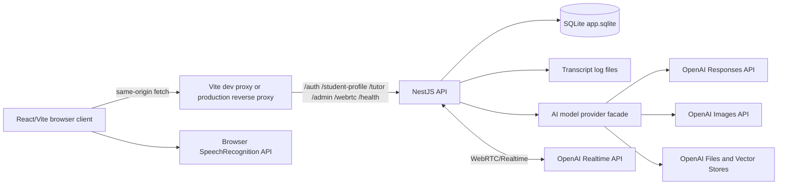

# EGMathTeacher Architecture

This file records the current repository architecture from source evidence.

## System Shape

EGMathTeacher is a browser-based POC with:

- React/Vite web client in `apps/web`
- NestJS API in `apps/api`
- SQLite local persistence through `node:sqlite`
- POC SQLite schema migration ledger in `schema_migrations`
- OpenAI-first model provider facade for tutor answers, specialist profile
  generation, RAG files/vector stores, and image generation
- OpenAI Realtime for inherited realtime voice
- optional production reverse proxy references under `deploy/`

No packaged desktop runtime was found.

## Source Architecture Diagrams

Editable Mermaid source diagrams live under `.ai/project/diagrams`. Rendered
SVG artifacts live under `.ai/project/diagrams/rendered` and are generated by
`npm run diagrams:render`.

Primary diagram sources:

- `.ai/project/diagrams/system-context.mmd`
- `.ai/project/diagrams/api-modules.mmd`
- `.ai/project/diagrams/onboarding-profile-sequence.mmd`
- `.ai/project/diagrams/tutor-rag-sequence.mmd`
- `.ai/project/diagrams/knowledge-upload-sequence.mmd`
- `.ai/project/diagrams/webrtc-realtime-sequence.mmd`
- `.ai/project/diagrams/data-model.mmd`
- `.ai/project/diagrams/assistant-governance.mmd`
- `.ai/project/diagrams/ui-tree.mmd`

The overview below mirrors `system-context.mmd` for quick reading.

## API Modules

| Module | Source | Responsibility |
| --- | --- | --- |
| `AppModule` | `apps/api/src/app.module.ts` | Loads global config and imports project modules. |
| `AuthModule` | `apps/api/src/auth` | Local registration, login, signed cookie sessions, admin/student roles. |
| `DatabaseModule` | `apps/api/src/database` | SQLite database initialization and query helpers. |
| `OpenAiClientModule` | `apps/api/src/openai` | REST client for OpenAI Responses, images, files, and vector stores. |
| `AiModelModule` | `apps/api/src/ai-model` | Model-provider facade for profile, tutor, image, file, and vector-store operations; OpenAI implemented, other providers stubbed. |
| `AiProviderModule` | `apps/api/src/providers` | Runtime voice provider abstraction; OpenAI Realtime implemented, other providers stubbed. |
| `StudentProfileModule` | `apps/api/src/student-profile` | First-login meeting profile generation, stored student memory, and explanation strategy retrieval. |
| `TutorModule` | `apps/api/src/tutor` | RAG tutor message handling and image generation. |
| `KnowledgeModule` | `apps/api/src/knowledge` | Admin knowledge upload and vector store status. |
| `WebRtcModule` | `apps/api/src/webrtc` | Session bootstrap, signaling, media bridge, provider events. |
| `ConversationModule` | `apps/api/src/conversation` | In-memory conversation turns and transcript file persistence. |
| `HealthModule` | `apps/api/src/health` | Health response and WebRTC audio support status. |

## Web Client

The web client:

- uses React and Vite
- uses Mantine UI components
- uses lucide icons
- uses `apps/web/src/i18n.ts` for Russian and English static UI copy
- calls the API through `apps/web/src/api.ts`
- defaults API base to `window.location.origin`
- proxies API paths in Vite dev server to `http://127.0.0.1:3000`
- enables local HTTPS on port `5137` when `.cert/localhost-key.pem` and
  `.cert/localhost-cert.pem` exist

Main UI areas in `apps/web/src/App.tsx`:

- auth screen with login/register mode
- first-login student meeting for profile creation
- tutor workspace with text and speech recognition input
- tutor turn cards for answer, tasks, examples, citations, and optional image
  generation
- admin knowledge screen for file upload and status table
- settings screen for language, voice input language, account info, and
  read-only student profile memory
- language switch shared by auth, first meeting, and authenticated app shell

## AI Model Provider Boundary

`apps/api/src/ai-model` owns the model-provider facade for profile generation,
tutor responses, explanatory images, file upload, and vector-store operations.
The current implementation delegates to `OpenAiClientService` when
`AI_MODEL_PROVIDER=openai`. Other model providers intentionally fail as stubs
until their text/RAG/image/file contracts are implemented.

## Endpoint Map

| Endpoint | Guard | Responsibility |
| --- | --- | --- |
| `POST /auth/register` | none | Create user and session cookie. |
| `POST /auth/login` | none | Validate credentials and set session cookie. |
| `POST /auth/logout` | none | Clear session cookie. |
| `GET /auth/me` | none | Return current cookie session or null. |
| `GET /student-profile/me` | authenticated | Return profile status and stored profile if present. |
| `PUT /student-profile/me` | authenticated | Create or replace the first-meeting student profile. |
| `POST /tutor/message` | authenticated | Send text or voice-origin prompt to tutor. |
| `POST /tutor/image` | authenticated | Generate explanatory image from prompt/context. |
| `POST /admin/knowledge/files` | admin | Upload knowledge file to OpenAI and attach to vector store. |
| `GET /admin/knowledge/status` | admin | Return active vector stores and knowledge file metadata. |
| `GET /health` | none | Return service status and WebRTC audio support. |
| `/webrtc/*` | none in current controller | WebRTC session bootstrap, token, SDP, ICE, close, and event endpoints. |

## Deployment Shape

Development:

- API listens on port `3000`.
- Web dev server listens on `5137`.
- Vite proxies API paths to the API process.
- Local HTTPS uses self-signed `.cert/localhost-*` files when present.

Production references:

- `README.md` names `https://atvardovsky.dev`.
- `deploy/pm2-egmathteacher.config.cjs` starts API from `apps/api/dist/main.js`
  on port `3000`.
- `deploy/nginx-atvardovsky.dev.conf` and
  `deploy/apache-atvardovsky.dev.conf` are reference reverse-proxy configs.

System web server config must not be installed or reloaded unless the user
explicitly asks for that deployment task.

## Architecture Gaps

- No packaged desktop runtime.
- POC SQLite migration ledger exists, but no production rollback, backfill, or
  backup architecture.
- CI exists under `.github/workflows/ci.yml`, but no remote run was observed
  from this local workspace.
- Editable Mermaid diagram sources, rendered SVG artifacts, render command,
  and drift-check command exist under `.ai/project/diagrams`.
- No formal observability or metrics architecture.
- No production privacy/compliance architecture for real student data.
